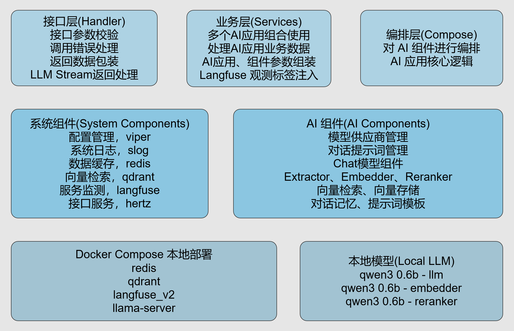
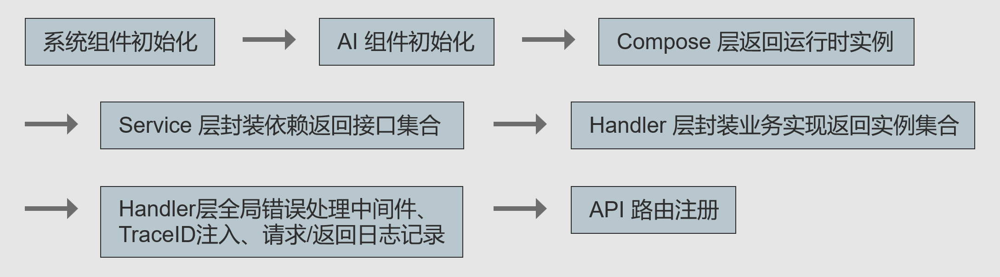
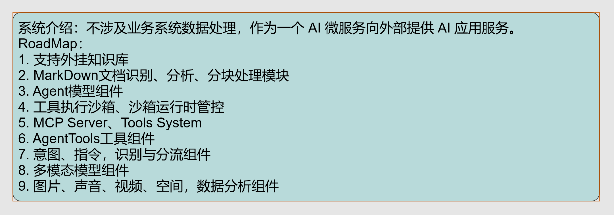

# Leoture-AI 基于 Eino 的 AI 应用微服务

## 详细文档

Leoture AI 应用微服务项目以 cloudwego/eino 项目为基础，设计了分层架构，并初始化了各类组件，方便开发者根据这些组件自定义编排AI应用。

设计与开发模型供应商和对话提示词管理模块、对话记忆功能模块，这些模块可以作为参考，也可以直接复用。

最少依赖设计，并提供对应依赖组件的 docker-compose 配置，提升项目部署能力。

## 项目架构图

## 项目目录结构
| 目录 | 描述 |
| --- | --- |
| bruno_api_test | API 测试用例 |
| cmd | 程序运行入口 |
| config | 系统配置、Prompt 配置 |
| deploy | 外部依赖组件部署资源 |
| docs | 项目文档资源 |
| eino_dev_tool | Eino 编排工具产出文件 |
| migrations | 项目迁移重新部署资源 |
| internal/cache | Redis 初始化 |
| internal/components | AI 应用组件 |
| internal/compose | AI 应用编排层 |
| internal/config | Viper 配置管理初始化 |
| internal/database | Qdrant 初始化 |
| internal/handler | 接口层 |
| internal/logger | Slog 日志管理初始化 |
| internal/observe | Langfuse 观测平台初始化 |
| internal/service | 业务层 |
| internal/types | 公共数据结构 |
| internal/utils | 系统通用工具 |

## Road Map

